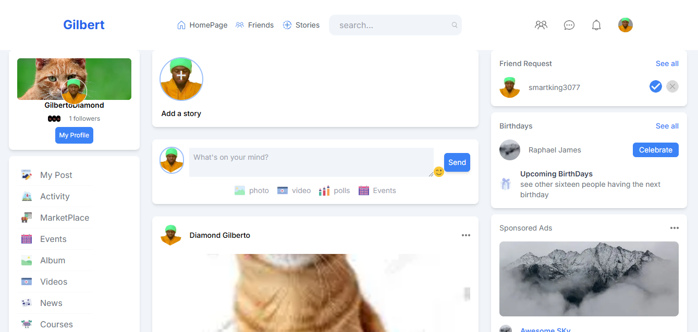

# Social Media App



This is a social media app where users can:
- Post images
- Send and accept friend requests
- Create stories

## Setup Instructions

### 1. Environment Variables

Create a `.env` file in the root directory and add the following variables:

```env
POSTGRES_URL=""
POSTGRES_PRISMA_URL=""
POSTGRES_URL_NO_SSL=""
POSTGRES_URL_NON_POOLING=""
POSTGRES_USER=""
POSTGRES_HOST=""
POSTGRES_PASSWORD=""
POSTGRES_DATABASE="" 
WEBHOOK_SECRET="" 
NEXT_PUBLIC_CLOUDINARY_CLOUD_NAME=""
NEXT_PUBLIC_CLOUDINARY_API_KEY=""
CLOUDINARY_API_SECRET=""

```
### 2. INSTALLATIONS

```shell
npm install
npm run dev
```


### 3.Enjoy